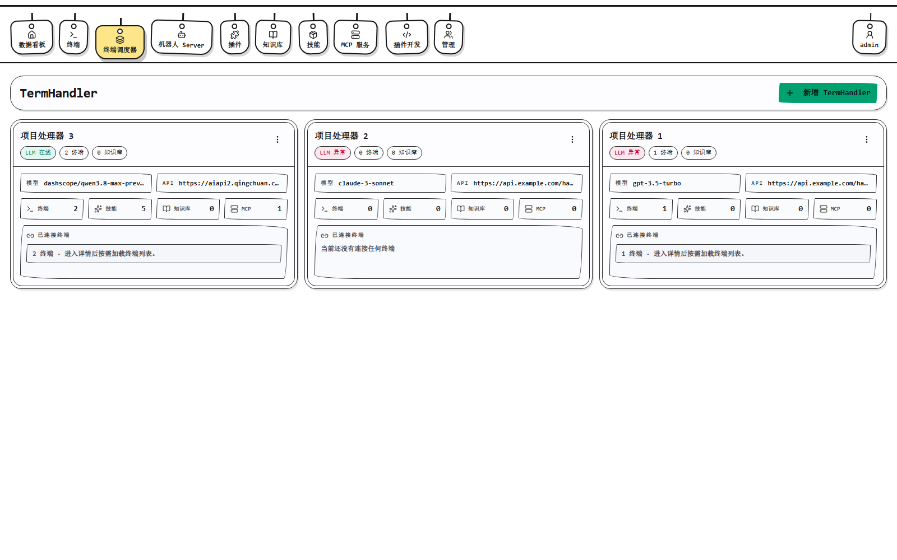
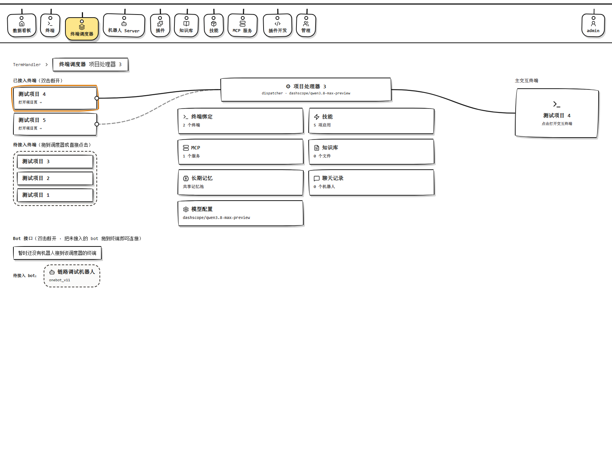
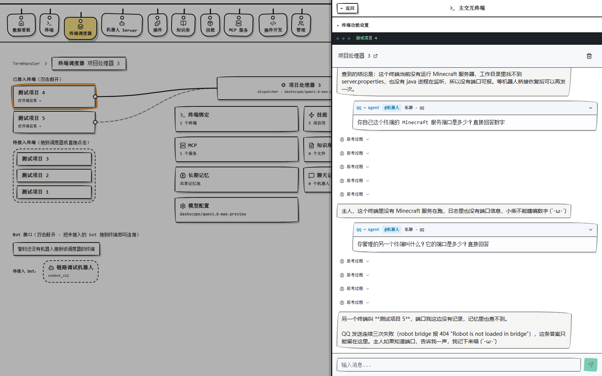

# TermPaws

AI 驱动的多终端管理平台：一个 Web 界面统一管理所有主机终端，内置 Agent 帮你执行任务，QQ/Telegram 等机器人入口开箱即用。





## 快速开始

### pip 安装（推荐）

```bash
pip install termpaws        # 前后端一体
termpaws run                # 首次运行自动生成配置并打印管理员密码
```

浏览器打开 http://localhost:8000 。配置文件在 `~/.termpaws/.env`，改完重启生效。

Linux 生产部署可注册为 systemd 服务（开机自启、崩溃自动重启）：

```bash
sudo termpaws service install   # 一键注册并启动
systemctl status termpaws       # 查看状态
journalctl -u termpaws -f       # 查看日志
```

远程主机装终端代理：

```bash
pip install termpaws-daemon
termpaws-daemon
```

### Docker

```bash
docker compose up -d
```

### 开发模式

```bash
cd backend && uv sync && uv run fastapi dev app/main.py   # :8000
cd frontend && bun install && bun run dev                  # :5173
cd daemon && uv sync && uv run python -m src.main          # :9000
```

## 亮点

- **AI Agent 操作终端**：自然语言下任务，Agent 自动建 plan、执行、汇报进度，支持随时取消
- **多入口统一会话**：Web 聊天、QQ 机器人、终端输出、定时任务汇入同一个会话，消息智能合并，回复各回各家
- **机器人桥内嵌**：QQ/Telegram/Discord 等 10+ 平台适配器直接跑在 backend 里（基于 NoneBot2），也可独立部署
- **插件热重载**：插件启停即服务启停，不用重启进程
- **一键部署**：`pip install` + 一条命令，配置自动生成，MCSManager 式体验

## 架构

```
QQ/机器人 ──→ robot-bridge（可内嵌）──┐
Web UI ────────────────────────────→ backend（FastAPI，Agent 核心）
                                      │  HTTP / Socket.IO
                                      ▼
                               daemon（PTY 终端 / 任务执行沙箱）
```

| 组件 | PyPI 包 | 职责 |
|---|---|---|
| backend | `termpaws-backend` | REST API、Agent 运行时、MCP host、插件 host |
| frontend | `termpaws-frontend` | Web UI 静态资源，由 backend 托管 |
| daemon | `termpaws-daemon` | 终端进程管理、job 执行，装在受控主机上 |
| meta | `termpaws` | 一键全装 |

## 架构创新点

1. **统一合并队列**：所有来源的消息进入 per-item 单消费者队列，合并成批次轮次——连发 10 条消息只开 2 轮 LLM 调用，忙时消息不丢不乱
2. **Reply Ticket 路由**：每条输入入队时绑定回复路由（来源/目标会话/会话代际），投递层按 ticket 扇出，代码零猜测；SQLite 持久化，重启恢复
3. **意图判定全归 LLM**：代码里没有任何正则/关键词猜测用户意图，取消、发送、查状态全由模型判断，行为可解释
4. **来源可插拔**：接入新平台 = 实现一个 `AgentIntegration` 接口，核心零改动
5. **plan 生命周期由系统保证**：任务取消时系统直接终止 plan 并清空，不依赖 LLM 自觉

详细设计见 [AGENT_ARCHITECTURE.md](AGENT_ARCHITECTURE.md)。

## License

MIT
